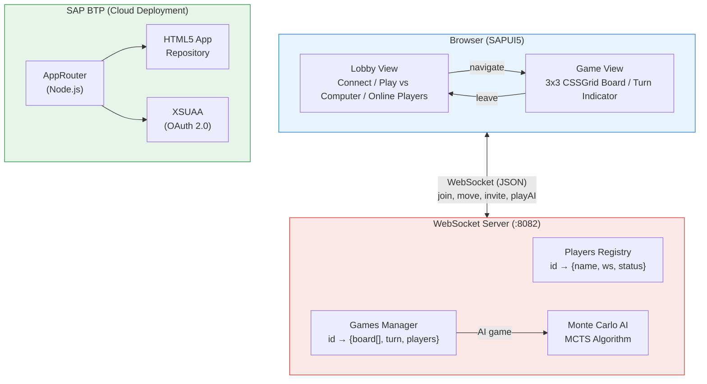
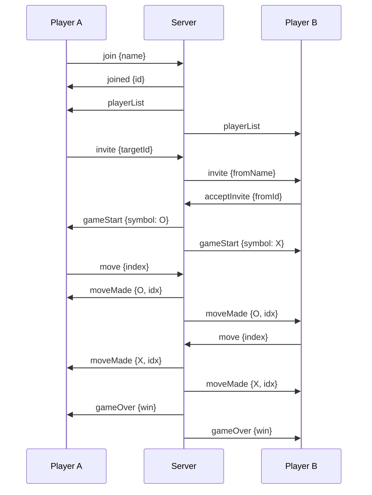
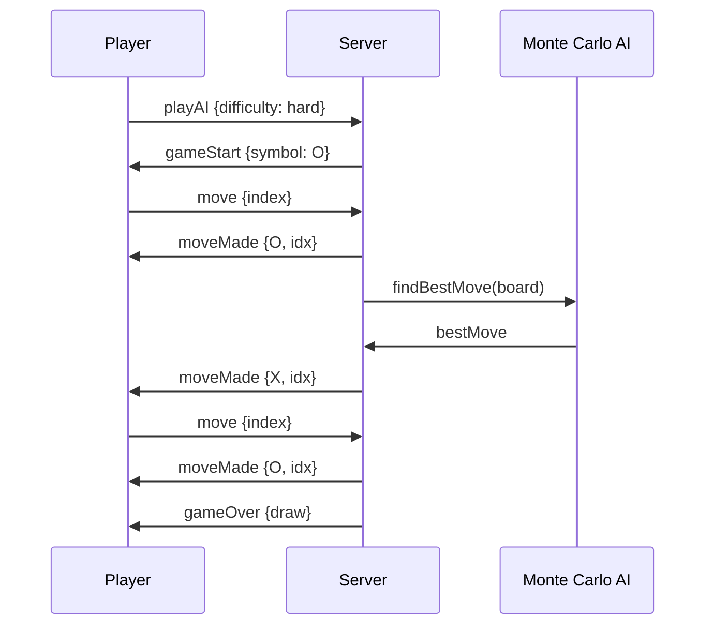
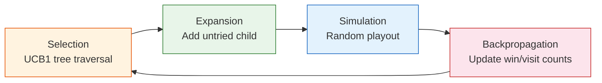

# Tic Tac Toe — SAP MTA + WebSocket Multiplayer

A multiplayer Tic Tac Toe game built with SAPUI5, featuring real-time online play via WebSocket and an AI opponent powered by Monte Carlo Tree Search.

## Features

- **Multiplayer** — Play against other players in real-time via WebSocket
- **AI Opponent** — Play against the computer with 3 difficulty levels (Easy, Medium, Hard)
- **Monte Carlo AI** — Server-side MCTS algorithm with configurable simulation depth
- **Lobby System** — See online players, send/receive game invitations
- **Auto-reconnect** — Automatic reconnection with exponential backoff
- **Game timeout** — 10-minute inactivity timeout prevents hanging games
- **SAP MTA** — Deployable to SAP BTP via HTML5 Application Repository

## Quick Start

### Prerequisites

- Node.js 18+
- npm

### Run Locally

Start both servers:

```bash
# 1. WebSocket server (handles multiplayer + AI)
cd server
npm install
npm start
# → ws://localhost:8082

# 2. UI server (serves SAPUI5 app)
cd tic-tac-toe
npx http-server webapp -p 8081 -c-1 -o
# → http://localhost:8081
```

Open **http://localhost:8081** in your browser. To test multiplayer, open a second browser window.

### How to Play

1. **vs Computer** — Select difficulty (Easy/Medium/Hard) and click "Play"
2. **vs Player** — Enter your name, click "Connect", then invite an online player

## Architecture



### WebSocket Protocol — Player vs Player



### WebSocket Protocol — Player vs AI



### MCTS Algorithm



## Project Structure

```
├── server/                     # Node.js WebSocket server
│   ├── server.js               # Game server, matchmaking, AI integration
│   └── MonteCarloAI.js         # Monte Carlo Tree Search algorithm
├── tic-tac-toe/                # SAPUI5 frontend application
│   └── webapp/
│       ├── view/               # XML views (App, lobby, game)
│       ├── controller/         # Controllers (lobby, game logic)
│       ├── custom/             # Custom board cell control
│       └── css/                # Styling
├── mta_tic-tac-toe_appRouter/  # SAP AppRouter (auth)
├── mta_tic-tac-toe_ui_deployer/# HTML5 repo deployer
└── mta.yaml                    # MTA deployment descriptor
```

## Tech Stack

| Layer | Technology |
|-------|-----------|
| Frontend | SAPUI5 1.65.6+, XML Views, CSSGrid |
| Backend | Node.js, WebSocket (ws) |
| AI | Monte Carlo Tree Search (MCTS) |
| Auth | SAP XSUAA |
| Deploy | SAP MTA, HTML5 App Repository |

## AI Difficulty Levels

| Level | MCTS Iterations | Behavior |
|-------|----------------|----------|
| Easy | 50–150 | Makes frequent mistakes |
| Medium | 400–600 | Plays reasonably well |
| Hard | 1800–2200 | Near-optimal play |

Iteration counts have built-in variance to make AI less predictable.

## Build for SAP BTP

```bash
# Install MTA Build Tool
npm install -g mbt

# Build MTA archive
mbt build

# Deploy (requires CF CLI + SAP BTP access)
cf deploy mta_archives/mta_tic-tac-toe_0.0.1.mtar
```

Note: The WebSocket server (`server/`) is not part of the MTA deployment and must be hosted separately.
