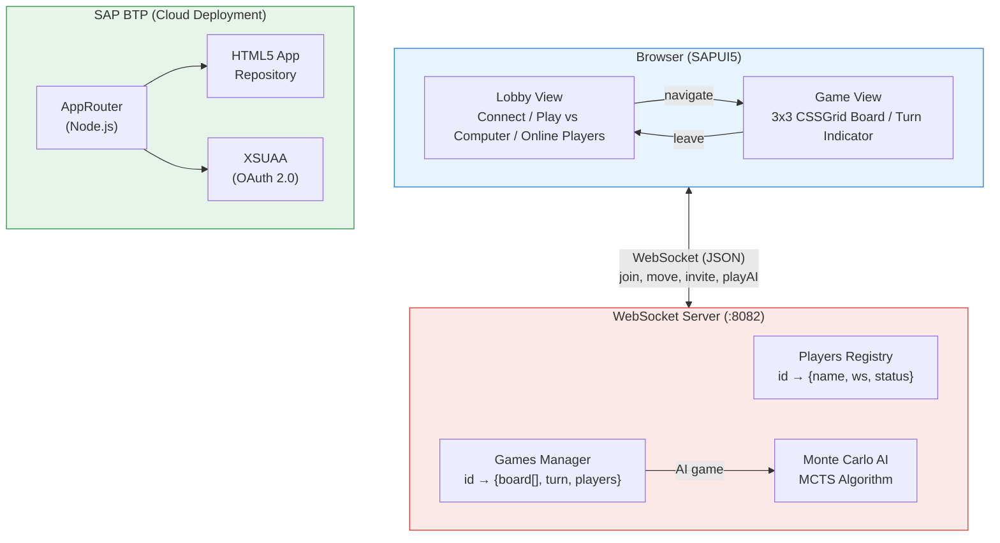
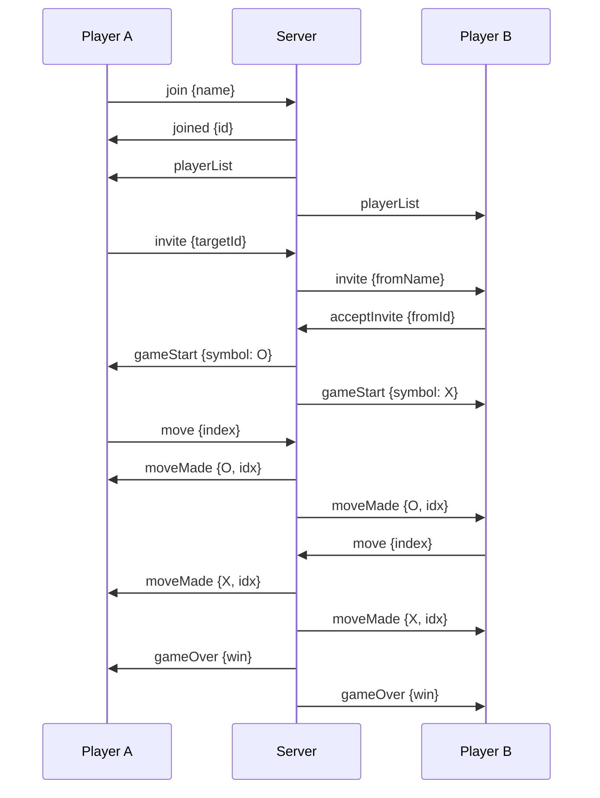
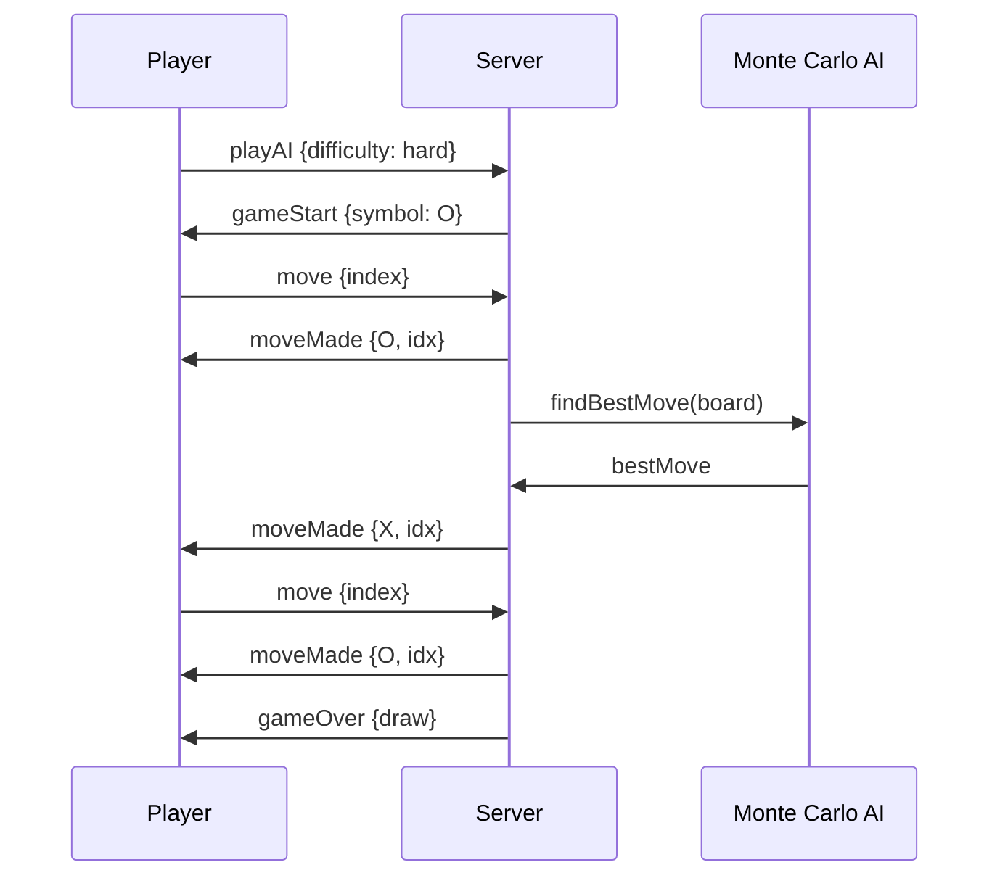
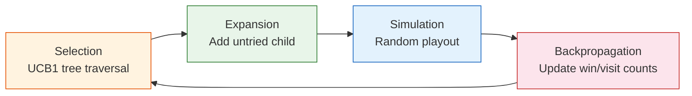

# Tic Tac Toe — SAP MTA + WebSocket Multiplayer

A multiplayer Tic Tac Toe game built with SAPUI5, featuring real-time online play via WebSocket and an AI opponent powered by Monte Carlo Tree Search.

**Contents:** [Features](#features) · [Quick Start](#quick-start) · [Development](#development) · [Architecture](#architecture) · [Project Structure](#project-structure) · [Tech Stack](#tech-stack) · [Deploy to SAP BTP](#deploy-to-sap-btp)

## Features

- **Multiplayer** — real-time play against other players via WebSocket, with a lobby showing online players and game invitations
- **AI opponent** — server-side Monte Carlo Tree Search with three difficulty levels (Easy, Medium, Hard)
- **Robust connection handling** — automatic reconnection with exponential backoff, 10-minute inactivity timeout to prevent hanging games
- **SAP MTA** — deployable to SAP BTP via the HTML5 Application Repository

## Quick Start

### Prerequisites

- Node.js 20+ (Node 22+ is required for the SAP AppRouter module when deploying to BTP)
- npm

### Run locally

The app needs two servers running side by side:

**1. WebSocket server** (multiplayer + AI) — listens on `ws://localhost:8082`

```bash
cd server
npm install
npm start
```

**2. UI server** (SAPUI5 app via UI5 Tooling) — listens on `http://localhost:8081`

```bash
cd tic-tac-toe
npm install
npm start
```

Then open **http://localhost:8081** in your browser.

### How to play

- **vs Computer** — select a difficulty (Easy / Medium / Hard) and click *Play*
- **vs Player** — enter your name, click *Connect*, then invite an online player. To test locally, open a second browser window.

## Development

All commands run from `tic-tac-toe/` (after `npm install`):

| Command | What it does |
|---------|--------------|
| `npm run build` | `ui5 build` → `dist/` |
| `npm test` | karma + karma-ui5 (unit + OPA, ChromeHeadless) |
| `npm run lint` | ui5lint |

The build/test toolchain uses **UI5 Tooling** (`@ui5/cli`) with **karma-ui5**; the UI5 runtime is loaded from the CDN at both runtime and test time.

More details (architecture notes, backend routing setup): [DEVELOPMENT.md](DEVELOPMENT.md).

## Architecture



<details>
<summary><b>WebSocket protocol — Player vs Player</b></summary>



</details>

<details>
<summary><b>WebSocket protocol — Player vs AI</b></summary>



</details>

### AI: Monte Carlo Tree Search

The AI runs a classic MCTS loop on the server:



Difficulty is controlled by the number of MCTS iterations per move, with built-in variance to make the AI less predictable:

| Level | MCTS iterations | Behavior |
|-------|-----------------|----------|
| Easy | 50–150 | Makes frequent mistakes |
| Medium | 400–600 | Plays reasonably well |
| Hard | 1800–2200 | Near-optimal play |

## Project Structure

```
├── server/                     # Node.js WebSocket server
│   ├── server.js               # Game server, matchmaking, AI integration
│   └── MonteCarloAI.js         # Monte Carlo Tree Search algorithm
├── tic-tac-toe/                # SAPUI5 frontend application
│   └── webapp/
│       ├── view/               # XML views (App, lobby, game)
│       ├── controller/         # Controllers (lobby, game logic)
│       ├── custom/             # Custom board cell control
│       └── css/                # Styling
├── mta_tic-tac-toe_appRouter/  # SAP AppRouter (auth)
├── mta_tic-tac-toe_ui_deployer/# HTML5 repo deployer
└── mta.yaml                    # MTA deployment descriptor
```

## Tech Stack

| Layer | Technology |
|-------|-----------|
| Frontend | SAPUI5 1.149.1 (pinned CDN; manifest minUI5Version 1.136), XML Views, CSSGrid |
| Backend | Node.js, WebSocket (ws) |
| AI | Monte Carlo Tree Search (MCTS) |
| Auth | SAP XSUAA |
| Deploy | SAP MTA, HTML5 App Repository |

## Deploy to SAP BTP

```bash
# Install MTA Build Tool
npm install -g mbt

# Build MTA archive
mbt build

# Deploy (requires CF CLI + SAP BTP access)
cf deploy mta_archives/mta_tic-tac-toe_0.0.1.mtar
```

> **Note:** The WebSocket server (`server/`) is not part of the MTA deployment and must be hosted separately. When deployed, the UI reaches it through the AppRouter `/game-server` route (see [DEVELOPMENT.md](DEVELOPMENT.md) → *Backend routing via the AppRouter*).

## Documentation

Architecture, build/run details, and the backend routing setup are documented in [DEVELOPMENT.md](DEVELOPMENT.md).
